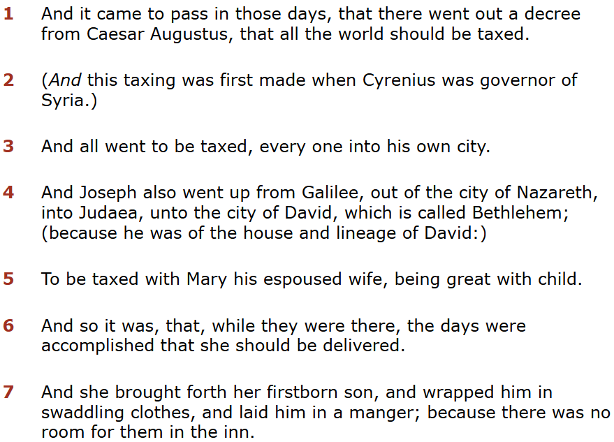
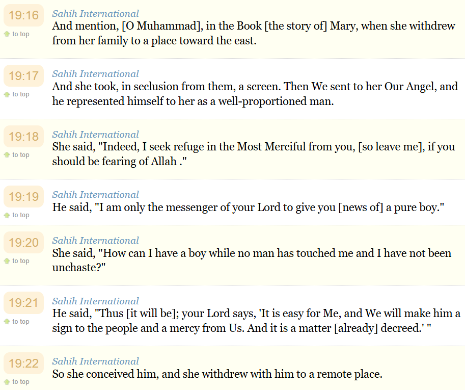
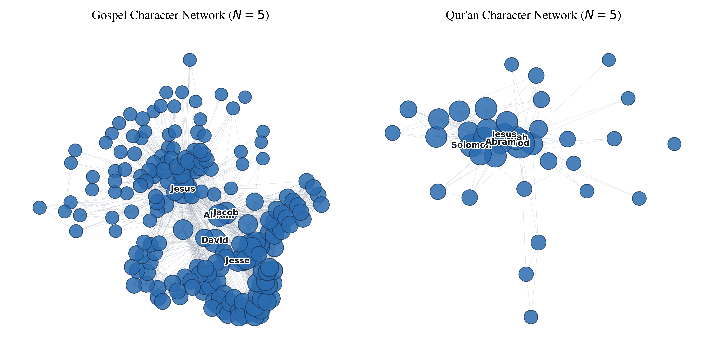
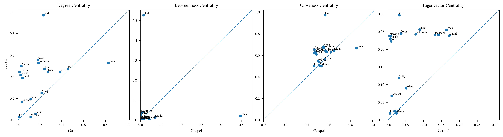
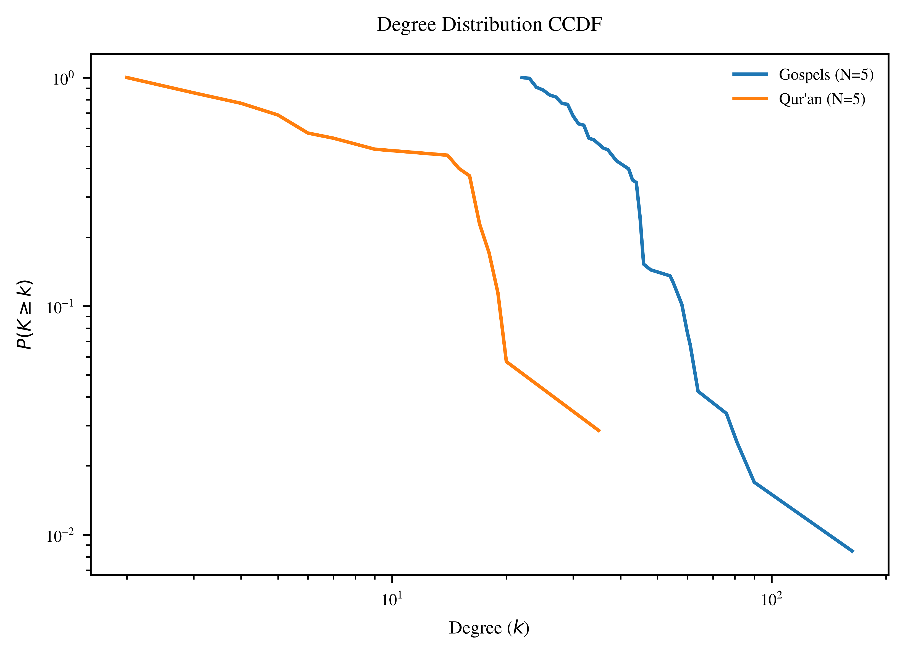
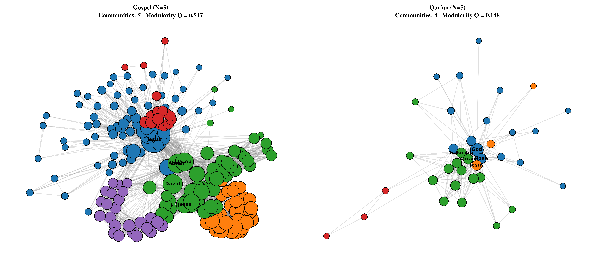

# Introduction

Practitioners of Abrahamic religions make up over half the world’s population ^[According to the *World Population Review*, 32% of the global population identify as Christian, 25% Muslim and 0.2% Jewish], and the holy texts of these faiths serve as the cornerstone for their respective beliefs and cultural traditions. Despite historical and modern-day contention between Christianity and Islam, the New Testament Gospels and the Qur’an have a deeply interconnected lineage. Shared figures bridge them conceptually, but the texts themselves are structured in fundamentally different ways. The four New Testament Gospels (Matthew, Mark, Luke, and John) are framed primarily as chronological narratives^[A chronological narrative is a type of storytelling that presents events in the order they occur in time, following a linear progression from beginning to end], whereas the Surahs of the Qur’an are formatted as a thematic discourse^[Its narratives use a literary style to convey moral and spiritual lessons, focusing on ethical, spiritual, and religious purposes rather than historical accuracy].

::: {#fig-income layout-ncol=2}

The Immaculate Conception as Chronological Narrative and Thematic Discourse
:::

This study analyzes textual data from both the Bible and Qur'an to construct, visualize, and compare their underlying character networks. Specifically, this study evaluates how these distinct literary styles alter the resulting graph topology among shared entities. Because the Bible and Qur'an differ substantially in both length and organization, this study constructs a series of comparable character co-occurrence networks using multiple textual proximity definitions. The resulting networks are then evaluated through analyses of global topology, node centrality, degree distributions, and community structure. Data for this study is drawn from the BibleData repository for the Gospels[@noauthor_bibledata_nodate] and the Sahih International English translation via the Qur’an API[@network_api_nodate].

This paper seeks to address three central research questions:

- To what extent do differences in literary organization correspond to differences in character network topology?
- How does the relative importance of shared characters change across the two character networks?
- Do both networks exhibit power-law degree distributions despite their fundamental structural differences?

Ultimately, this comparative network analysis serves to show that the shared principal figures rise above the structural settings of their respective texts. Beyond religious and literary divides, these texts represent a shared foundation of human hope and eternal faith.

# Literature Review

In the *noble*^[Jest: a thing said or done for amusement; a joke] pursuit of analyzing textual data, the application of network analytics provides a unique, empirical perspective. Vague adjectives to describe characters are traded for empirical metrics like betweenness centrality, subjective groupings yield to formal community detection algorithms, and prominence stops being a matter of opinion and starts being a function of degree density[@massey_social_2016].

While traditional social networks require explicit interactions, character networks derived from literature often rely on co-occurrence[@drpinghaus_social_2022]. Co-occurence^[Social networks require explicit interactions between characters, co-presence characters are simply present in the same scene, and co-occurrence characters appear within a defined threshold] models emphasize relational proximity without requiring a line of spoken dialogue. This approach leverages the implicit, chronological nature of written narrative, capturing structural dependencies that direct dialogue models miss.  

However, applying modern natural language processing (NLP) techniques to ancient religious texts introduces distinct computational challenges. Standard Named Entity Recognition (NER) models struggle to identify `PERSON` entities when a character is referred to by multiple titles within the same text. Beyond entity resolution, establishing an appropriate threshold for what constitutes an implicit relationship remains a sticking point.

In biblical studies, network analytics serves a greater purpose than simply confirming that Jesus is the central network hub[@grandjean_data_2013]. These methods can uncover distinct narrative communities[@dorpinghaus_structural_2026], track how character influence shifts as a story progresses, and highlight bridges holding different scenes together. Unsurprisingly, a recurring theme across the literature is the difficulty of edge definitions. Whether defining by scene co-presence, verse co-occurrence, or a sliding window of $N$ verses completely reshapes network density, degree distributions, and centrality rankings. 

# Methodology

To construct the co-occurrence networks, data was extracted from two publicly available datasets:

1) **Qur'an:** Textual data was gathered via the Qur'an API[@network_api_nodate], utilizing the Sahih International English translation. Translated by Emily Assami, Mary Kennedy, and Amatullah Bantley, this version is known for its modern, un-archaic language while maintaining a conservative interpretation. An English translation^[Transliteration is converting from one writing system to another while preserving the pronunciation, translation is converting the meaning of a text from one language to another] was selected because Named Entity Recognition (NER) is substantially more capable with English than Arabic, enabling more consistent identification and matching of individuals across texts.

2) **Gospels:** Character co-presence data for the New Testament Gospels was sourced from the open-source BibleData project[@noauthor_bibledata_nodate]. Specifically, I utilized the pre-structured `PersonVerseApostolic.csv` file, which records all individuals co-occurring within each verse.

The comparative analysis was restricted to the intersection of both datasets, consisting of 19 figures (out of the 198 Gospel figures and 38 Qur'anic figures) that appear in both networks. The Biblical naming conventions of the shared figures are: **Aaron, Abraham, Adam, David, Elisha, Gabriel, God, Isaac, Jacob, Jesus, John, Jonah, Joseph, Lot, Mary, Moses, Noah, Satan, and Solomon.**

## Global Topology

To represent the Qur'an and the Gospels as networks in this study, nodes represent named individuals, edges represent co-occurrence, and the networks are undirected.

To establish consistent node naming conventions, character labels across the texts were consolidated using the `person_id` column by BibleData[@noauthor_bibledata_nodate]. For example, in the Gospel corpus, `YHVH_1` represents Jesus (linking to 'Messiah' and 'Son of David'), whereas `YHVH_2` denotes God the Father.

Because textual co-occurrence is not uniquely defined, several textual proximity definitions were considered, including verse (ayah)-level co-occurrence ($N=1$), a sliding window of five verses (ayahs) ($N=5$), and chapter (surah)-level co-occurrence. Table 1 summarizes the resulting network topology under each definition. Verse-level co-occurrence produced relatively sparse networks, whereas chapter-level co-occurrence generated overly dense graphs. The sliding $N=5$ definition was selected because it balanced network connectivity with one-off narratives while avoiding the excessive density introduced by chapter-level co-occurrence. Consequently, all subsequent analyses were conducted using the $N=5$ networks.

| Network | Proximity Definition | Nodes ($|V|$) | Edges ($|E|$) | Density ($D$) | Avg. Clustering Coef. ($C$) | Avg. Path Length ($L$) | Diameter ($d$) |
| :--- | :--- | ---: | ---: | ---: | ---: | ---: | ---: |
| Gospel | Verse ($N=1$) | 189 | 465 | 0.0262 | 0.7450 | 3.4567 | 8 |
| Gospel | Sliding Window ($N=5$) | 198 | 2,657 | 0.1362 | 0.7871 | 1.9986 | 3 |
| Gospel | Chapter | 198 | 5,682 | 0.2913 | 0.896 | 1.7087 | 2 |
| Qur'an | Ayah ($N=1$) | 37 | 106 | 0.1592 | 0.5825 | 2.1176 | 4 |
| Qur'an | Sliding Window ($N=5$) | 37 | 184 | 0.2763 | 0.7786 | 1.7718 | 3 |
| Qur'an | Surah | 37 | 326 | 0.4895 | 0.8441 | 1.5105 | 2 |

: Comparison of Topology Using Textual Proximity Techniques {#tbl-network-metrics}

Global network structure was characterized using density, average clustering coefficient, average shortest path length, and network diameter. Together these metrics quantify the overall connectivity, local cohesiveness, and efficiency of information flow within each network.

## Centrality Measurements

Node importance was evaluated using four centrality measures: **degree centrality, betweenness centrality, closeness centrality, and eigenvector centrality.**

**Degree Centrality:** Degree is a simple centrality measure that counts how many neighbors a node has. A node is important if it has many neighbors, or, in the directed case, if there are many other nodes that link to it, or if it links to many other nodes.

$$
C_D(v) = \frac{\deg(v)}{N - 1}
$$

* $\deg(v)$: Number of edges connected to node $v$
* $N$: Total number of nodes in the network

**Closeness Centrality:** In a connected graph, the normalized closeness centrality (or closeness) of a node is the average length of the shortest path between the node and all other nodes in the graph. Thus the more central a node is, the closer it is to all other nodes.

$$
C_C(v) = \frac{N - 1}{\sum_{u \neq v} d(v, u)}
$$

* $d(v, u)$: Shortest path distance (geodesic distance) between node $v$ and node $u$

**Betweeness Centrality:** Betweenness centrality quantifies the number of times a node acts as a bridge along the shortest path between two other nodes.

$$
C_B'(v) = \frac{2}{(N - 1)(N - 2)} \sum_{s \neq v \neq t} \frac{\sigma_{st}(v)}{\sigma_{st}}
$$

* $\sigma_{st}$: Total number of shortest paths from node $s$ to node $t$
* $\sigma_{st}(v)$: Number of those shortest paths that pass through node $v$

**Eigenvector Centrality:** Eigen-centrality is a prestige score which measures the node’s influence. It is a nodal attribute, as is the case with all other centrality measures. Connections to high-scoring nodes contribute more to the score of the node in question than equal connections to low-scoring nodes. A high Eigen-centrality means the node is connected to many nodes with high scores.

$$
\lambda x_v = \sum_{u \in N(v)} x_u = \sum_{u=1}^{N} A_{vu} x_u
$$

## Power-Law Distribution

A power law is a functional relationship between two quantities, where a relative change in one quantity results in a relative change in the other quantity proportional to a power of the change, independent of the initial size of those quantities. In real networks, properties are often power-law distributed.

$$
f(x) = \alpha x^{-k}
$$

## Community Detection

Communities are sets of nodes with a relatively higher connection density within the cluster than between the clusters. Community Detection is the process of identifying groups of nodes with dense connections within a graph.

Communities were identified using the **Louvain algorithm**, which partitions the network by maximizing the modularity $Q$ score^[Modularity is the fraction of the edges that fall within the given groups minus the expected fraction if edges were distributed at random] across the network. Louvain was selected because it is efficient and effective for large networks.

Louvain uses a two-phase iterative optimization process. In phase 1, each node is moved to the community that yields the highest gain in modularity. In phase 2, the algorithm aggregates nodes of the same community and builds a new network. These steps are repeated iteratively until modularity is maximized and cannot be increased further.

$$
Q = \frac{1}{2m} \sum_{ij} \left[ A_{ij} - \frac{k_i k_j}{2m} \right] \delta(c_i, c_j)
$$

# Results

Figure 2 provides an overview of the final character co-occurrence networks constructed using the sliding $N=5$ definition for textual proximity. Nodes represent named figures, node size corresponds to degree, and the five characters with the highest degree in each network are labeled. The visualization highlights substantial differences in network scale. 

The Gospel network contained 198 figures connected by 2,657 edges, whereas the Qur'anic network contained only 37 figures connected by 184 edges. Despite its smaller size, the Qur'anic network exhibited greater overall density ($D=0.2763$ compared to $D=0.1362$).

| Network | Proximity Definition | Nodes ($|V|$) | Edges ($|E|$) | Density ($D$) | Avg. Clustering Coef. ($C$) | Avg. Path Length ($L$) | Diameter ($d$) |
| :--- | :--- | ---: | ---: | ---: | ---: | ---: | ---: |
| Gospel | Sliding Window ($N=5$) | 198 | 2,657 | 0.1362 | 0.7871 | 1.9986 | 3 |
| Qur'an | Sliding Window ($N=5$) | 37 | 184 | 0.2763 | 0.7786 | 1.7718 | 3 |

: Final Comparison of Textual Proximity Techniques {#tbl-network-metrics}

Both networks demonstrated high clustering, with average clustering coefficients^[The tendency of nodes in a graph to cluster together] of 0.7871 and 0.7786 for the Gospel and Qur'an, respectively. Additionally, both networks had comparable diameters^[The maximum distance between any two nodes in a network] ($d=3$), suggesting that despite differences in scale, information can propagate through a small number of figures in either text.

Centrality measures were then compared among figures appearing in both texts to evaluate whether shared characters occupied similar structural positions across networks.

|  | $G_{Degree}$ |   $Q_{Degree}$ |   $G_{Between}$ |   $Q_{Between}$ |   $G_{Close}$ |   $Q_{Close}$ |   $G_{Eigen}$ |   $Q_{Eigen}$ |
|:------------|----------------:|----------------:|---------------------:|---------------------:|-------------------:|-------------------:|---------------------:|---------------------:|
| Jesus       |           0.827 |           0.528 |                0.496 |                0.02  |              0.853 |              0.667 |                0.164 |                0.255 |
| God         |           0.234 |           0.972 |                0.015 |                0.528 |              0.566 |              0.973 |                0.032 |                0.297 |
| Moses       |           0.117 |           0.028 |                0.002 |                0     |              0.531 |              0.5   |                0.024 |                0.019 |
| Mary        |           0.218 |           0.25  |                0.015 |                0.006 |              0.561 |              0.562 |                0.031 |                0.119 |
| Jacob       |           0.386 |           0.444 |                0.043 |                0.003 |              0.62  |              0.632 |                0.142 |                0.241 |
| Joseph      |           0.015 |           0.444 |                0     |                0.006 |              0.477 |              0.632 |                0.008 |                0.238 |
| David       |           0.457 |           0.472 |                0.072 |                0.012 |              0.648 |              0.643 |                0.172 |                0.239 |
| Satan       |           0.162 |           0.056 |                0.004 |                0     |              0.513 |              0.507 |                0.019 |                0.025 |
| Solomon     |           0.188 |           0.528 |                0.008 |                0.037 |              0.552 |              0.667 |                0.078 |                0.243 |
| Noah        |           0.183 |           0.556 |                0.002 |                0.036 |              0.55  |              0.679 |                0.089 |                0.256 |
: Comparison of Shared Character Centrality Metrics {#tbl-network-metrics}

The most pronounced contrast was between God and Jesus. In the Gospel network, Jesus exhibited exceptionally high degree centrality ($D=0.827$), closeness centrality ($C=0.853$), and betweenness centrality ($B=0.496$), indicating that he serves as the primary hub connecting otherwise disparate groups of characters. In contrast, God occupied the most central position in the Qur'anic network, with the highest degree ($D=0.972$), closeness ($C=0.973$), and betweenness ($B=0.528$) values. This difference reflects the unique position of each character in the faith.

Furthermore, David displayed consistently high degree centrality in both the Gospel ($0.457$) and Qur'an ($0.472$). Conversely, Joseph has a substantial difference in network role. While Joseph had minimal connectivity in the Gospel network ($D=0.015$), he was among the most connected figures in the Qur'anic network ($D=0.444$). Figure 3 showcases these findings graphically. 

Figure 4 shows the complementary cumulative degree distributions (CCDFs)^[A Complementary Cumulative Distribution Function (CCDF) plot is a statistical tool used to analyze the probability of a signal exceeding a certain threshold] for the Gospel and Qur'anic character networks alongside their maximum-likelihood power-law fits. For both networks, the likelihood-ratio tests favored the alternative distributions over the pure power-law model^[The powerlaw package only fits the portion of the distribution that most resembles a power law; it estimates $x_{min}$ by finding the cutoff that minimizes the Kolmogorov–Smirnov distance between the empirical data and the fitted power law]. The Gospel network favored exponential ($R=-3.05$, $p=0.002$) and lognormal ($R=-2.59$, $p=0.010$) models. Similarly, the Qur'anic network favored the exponential ($R=-2.76$, $p=0.006$) and lognormal ($R=-2.48$, $p=0.013$) alternatives. Negative likelihood-ratio values indicate that the alternative distribution provides a better fit than the power law, while the corresponding $p$-values suggest that these differences are statistically significant.

{width=40%}

Community detection revealed contrasting levels of modular organization. The Gospel network demonstrated stronger community structure, with a modularity score of 0.517, indicating relatively distinct clusters of characters. In contrast, the Qur'anic network displayed weaker modularity ($Q=0.148$), suggesting a more interconnected structure without strongly separated communities.

{width=70%}

# Discussion 

This study highlights that the Gospel and Qur'anic character networks exhibit distinct structural organizations despite sharing a substantial number of figures. The Gospel network contains a much larger number of identified figures, reflecting the broader nature of the New Testament narratives. However, the Qur'anic network exhibits substantially greater density, reflecting frequent connections within thematic discourse.

Comparison of centrality measures among shared figures reveals that the same individual may occupy substantially different structural roles across traditions. While some figures, such as David and Mary, maintain relatively similar importance in both networks, others, namely Jesus, demonstrate notable differences. These differences illustrate that shared characters should not be interpreted as occupying identical importance simply because they appear in both traditions. 

The community detection analysis further demonstrates differences in how characters are grouped within each tradition. The Gospel network exhibited stronger modular structure, suggesting the presence of more clearly separated clusters of characters. In contrast, the Qur'anic network demonstrated weaker modularity despite its higher density. This suggests that recurring figures are less separated into independent narrative communities and instead participate in overlapping relational structures throughout the text. 

The absence of a power-law relationship in either network also provides an important observation. Although both networks contain highly connected figures, their degree distributions are better described by alternative heavy-tailed distributions rather than a strict scale-free model.

Several limitations should be considered when interpreting these results. First, co-occurrence networks represent textual association rather than semantic, theological, or historical relationships. Two figures appearing within the same textual window does not necessarily indicate a meaningful relationship between them; it only captures their proximity within the source text. Second, the construction of edges depends heavily on the definition of textual proximity. Alternative proximity definitions may produce different network structures. Finally, this analysis relies on English translations and automated entity identification. Translation choices and named entity recognition errors may influence the resulting networks. Future work could incorporate original-language texts, more sophisticated entity resolution, and temporal or narrative sequence analysis to further investigate how character relationships develop throughout each tradition.

Overall, the network approach reveals that the Gospel and Qur'anic texts share a common set of figures while organizing those figures into substantially different relational structures. The Gospel network is larger and more modular, whereas the Qur'anic network is smaller but more densely interconnected. 

# Conclusion

This study applied network analysis to compare the character structures of the New Testament Gospels and the Qur'an, demonstrating how differences in literary organization influence the resulting relational networks. This research sought to transform two historically significant religious texts into comparable network structures.

The results demonstrate that although the Gospels and Qur'an share a substantial set of figures, these characters occupy different structural roles within each tradition. The Gospel network exhibited a larger and more modular structure, reflecting a broader cast of characters and more differentiated narrative communities. In contrast, the Qur'anic network contained fewer figures but demonstrated greater density, indicating that recurring characters are connected across a more tightly integrated textual structure. Centrality analysis further showed that shared figures do not necessarily maintain identical levels of prominence across traditions. These differences highlight that character importance is not an inherent property of the figure alone, but emerges from the narrative context in which that figure appears. 

Ultimately, this work demonstrates that computational network analysis can provide a complementary perspective for studying religious literature. Rather than replacing traditional textual interpretation, network methods reveal structural patterns that may otherwise remain difficult to quantify, offering new insight into how shared narratives and figures are organized across distinct literary traditions.

# References
::: {#refs}
:::